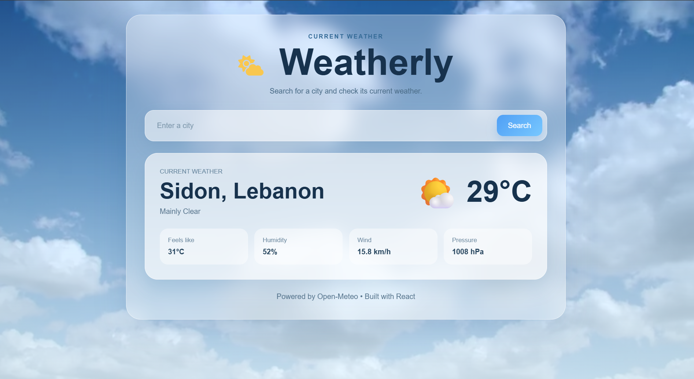

# 🌤️ Weatherly – React Weather Application

A modern and responsive weather application built with **React** that allows users to search for any city and view its current weather conditions in real time using the **Open-Meteo API**.

This project was developed as part of the **Codveda Technologies Web Development Internship (Level 2 – React Front-End Framework)** to demonstrate React fundamentals, API integration, component-based architecture, and responsive UI design.

---

## 🚀 Live Demo

🔗 **[View Live Demo](https://react-weather-app-iota-nine.vercel.app/)**

---

## 📸 Preview

<p align="center">
  
</p>

---

## ✨ Features

- 🔍 Search weather by city name
- 🌍 Real-time weather data using the Open-Meteo API
- 🌤️ Dynamic weather descriptions
- ☀️ Dynamic weather icons
- 🌡️ Current temperature display
- 🤗 "Feels Like" temperature
- 💧 Humidity information
- 💨 Wind speed
- 🌍 Atmospheric pressure
- ⚠️ Error handling for invalid city names
- ⏳ Loading state while fetching data
- 📱 Fully responsive design
- 🎨 Modern glassmorphism user interface
- 🖼️ Custom favicon and application branding

---

## 🛠️ Technologies Used

- React
- JavaScript (ES6+)
- Vite
- HTML5
- CSS3
- Open-Meteo API
- Open-Meteo Geocoding API
- Font Awesome

---

## 📂 Project Structure

```text
src/
│
├── components/
│   ├── Header.jsx
│   ├── SearchBar.jsx
│   ├── WeatherCard.jsx
│   └── Footer.jsx
│
├── utils/
│   └── weatherCode.js
│
├── App.jsx
├── App.css
├── index.css
└── main.jsx
```

---

## ⚙️ How It Works

1. The user enters a city name.
2. The application sends a request to the Open-Meteo Geocoding API.
3. The API returns the city's latitude and longitude.
4. Using these coordinates, the application requests the current weather from the Open-Meteo Weather API.
5. The weather information is displayed with a matching description and icon.

---

## 📚 What I Learned

During this project I practiced:

- Building reusable React components
- Managing state with `useState`
- Passing data using props
- Handling form submissions
- Working with asynchronous JavaScript (`async/await`)
- Consuming REST APIs using `fetch()`
- Conditional rendering
- Error handling
- Organizing React projects
- Responsive web design
- Clean UI development using CSS

---

## 📦 Installation

Clone the repository:

```bash
git clone https://github.com/reemsaijary/react-weather-app.git
```

Navigate to the project:

```bash
cd react-weather-app
```

Install dependencies:

```bash
npm install
```

Run the development server:

```bash
npm run dev
```

Build for production:

```bash
npm run build
```

---

## 🌐 APIs Used

### Open-Meteo Weather API

Provides current weather information.

- https://open-meteo.com/

### Open-Meteo Geocoding API

Converts city names into geographical coordinates.

- https://open-meteo.com/en/docs/geocoding-api

---

## 👩‍💻 Author

**Reem Saijary**

- **GitHub:** https://github.com/reemsaijary
- **LinkedIn:** https://www.linkedin.com/in/reem-saijary/
---

## 📄 License

This project was created for educational purposes as part of the Codveda Technologies Web Development Internship.